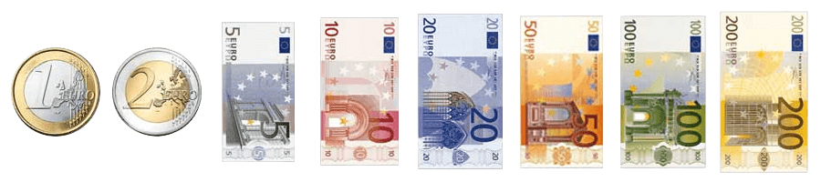
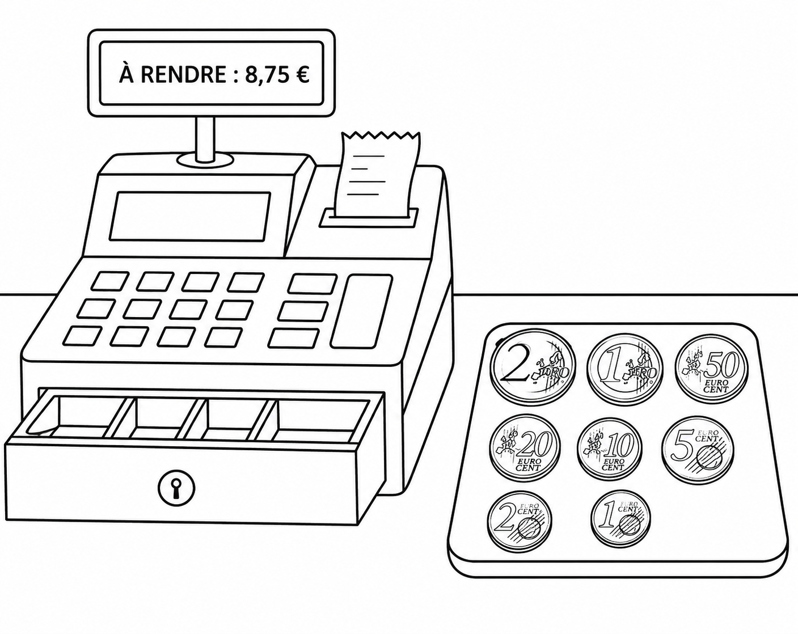

<link rel="stylesheet" href="../../assets/style.css" />
<script src="https://cdn.jsdelivr.net/npm/mathjax@3/es5/tex-mml-chtml.js"></script>

# Algorithmes gloutons

## Introduction

Un algorithme glouton résout un problème étape par étape. À chaque étape il fait le meilleur choix dans la situation présente. La solution trouvée n’est pas nécessairement optimale (la meilleure) mais l’algorithme permet de trouver rapidement une solution.

## Présentation du problème

### Énoncé

Étant donné un système de monnaie, comment rendre une somme donnée avec le nombre minimal de pièces et de billets ?

### Exemple avec le système monétaire européen ( pièces et billets )   

<div style="display: flex; flex-direction:column;  text-align: center; ">
  
</div>
<br>

Pour rendre 6 €, les combinaisons possibles sont :

- 1 billet de 5 € et 1 pièce de 1 € ;

- 3 pièces de 2 € ;

- 6 pièces de 1 € ;

Le rendu avec le nombre minimal de pièce ou billets est le premier.

## Activité débranché

### Modélisation du problème du rendu de monnaie
Durant les grandes vacances, vous effectuez un petit boulot au sein d'une épicerie de quartier en tant que caissier-ière. Votre mission, encaisser les clients, et donc il vous arrive parfois de devoir rendre la monnaie.  
Vous utilisez la caisse enregistreuse pour savoir le montant exact à rendre, malheureusement, cette caisse ne vous dit pas quelles sont les pièces à utiliser pour atteindre la somme à rendre en un minimum de pièces.

<div style="display: flex; flex-direction:column;  text-align: center; ">
  
</div>
<br>

Pour être plus efficace, et parce que vous avez un peu de temps durant votre pause, vous cherchez une méthode efficace pour rendre la monnaie en utilisant le moins de pièces possible, et surtout en rendant la bonne somme !

### Première partie : Reflexion

Par groupe de 2, 3 ou 4 :
- 🖊️ Trouvez la somme à rendre pour chacun des prix et des billets distribués par vos clients;
- Pour chacune des sommes à rendre, cherchez les pièces à utiliser pour atteindre cette somme. Vous pourrez pour cela vous aider des sacs de pièces distribués. Attention ! Vous devez utiliser le moins de pièces possibles !


### Deuxième partie : Analyse

🖊️ Questions de compréhension :
1. Comment avez-vous choisi la pièce à rendre en premier ? En deuxième ?

2. En quoi consiste à cette stratégie ?

3. A votre avis, cette stratégie fonctionne-t-elle dans n'importe quels systèmes monétaires ? Justifiez par un exemple.

🖊️ Proposer une méthode systématique pour répondre à ce problème. Cette méthode sera ensuite utilisée par un autre groupe. Attention à être précis dans vos étapes de résolution !


### Troisième partie : Programmation de la solution

Le système monétaire choisi ici sera stocké dans une liste **du plus grand au plus petit**. Celle-ci sera composé des pièces sous la forme de centime (2€ = 200 centimes, ...) Ex : `liste_centime = [200, 100, 50, 20, 10, 5, 2, 1]`.

La combinaison retenue sera présentée sous la forme d'une liste dont la somme des valeurs est égale au montant à rendre : `liste_rendu = [20, 5, 2, 2]`.

💻 Proposer une fonction qui prend le montant à rendre et le système monétaire en paramètre et renvoie la combinaison optimale.

```python
def rendu_monnaie(montant, systeme):
    rendu = []

    for piece in systeme:
        while montant >= piece:
            rendu.append(piece)
            montant = montant - piece

    return rendu

systeme_euro = [200, 100, 50, 20, 10, 5, 2, 1]

print(rendu_monnaie(287, systeme_euro))

```

### Pour allez plus loin !

Considérons le système monétaire constitué des trois pièces suivantes : 1, 3 et 4.

🖊️ Quelle est la combinaison de pièces qui contient le moins de pièces pour rendre la valeur 6 ?

💻 Quelle combinaison l'algorithme glouton va-t-il proposer ? Conclure.

#### Système canonique

Un système monétaire est dit canonique lorsque l'algorithme glouton donne une solution optimale.

Actuellement tous les systèmes monétaires du monde sont des systèmes canoniques.

## Algorithmes glouton

### Les problèmes d'optimisation

En informatique, les problèmes d'optimisation sont des problèmes pour lesquels on cherche la meilleure solution suivant un critère donné -> un critère d'optimisation.

### La force brute

L'une des méthodes pour répondre à ce type de problème consiste :

- à rechercher de façon exhaustive toutes les solutions,

- à trier ces solutions suivant le critère d'optimisation,

- à garder la solution optimale.

Cette méthode, dite par force brute, peut être valable pour des problèmes faisant appel à un petit nombre de données. Cependant, elle n'est souvent pas envisageable avec un grand nombre de données.

### La méthode gloutonne

La méthode gloutonne consiste à découper le problème en étapes successives similaires et plus simples que le problème global. Il s'agit alors, pour chaque étape, de rechercher une **solution optimale** (dite solution locale), **sans modifier les résultats des étapes précédentes**.

## D'autre problèmes très ... gloutons

### optimisation de la visite d'un parc d'attraction (sans ordinateur)

Vous visitez un parc d'attractions proposant des spectacles à différents horaires. Voici les horaires des différents spectacles :

| Spectacle | A | B | C | D | E | F | G | H | I | J |
|:---:|:---:|:---:|:---:|:---:|:---:|:---:|:---:|:---:|:---:|:---:|
| Horaire | 10 h à 11 h | 10 h 30 à 11 h 30 | 11 h à 12 h 30 | 11 h 30 à 12 h | 12 h à 13 h | 13 h à 15 h | 13 h 30 à 14 h | 14 h à 15 h 30 | 15 h à 16 h | 16 h à 17 h 30 |


Vous avez remarqué qu'il n'est pas possible d'assister à tous les spectacles puisque certains ont lieu à des moments communs. Vous souhaitez assister à un maximum de spectacles sur la journée. Quels spectacles devez-vous choisir ?

Voici deux stratégies gloutonnes possibles :

- **Stratégie n°1** : choisir le spectacle dont l'heure de début arrive le plus tôt (parmi les spectacles dont l'heure de début est postérieure aux créneaux des spectacles déjà choisis). Cette stratégie est basée sur l'idée que moins on attend entre deux spectacles, plus on en verra.

- **Stratégie n°2** : choisir le spectacle dont l'heure de fin arrive le plus tôt (parmi les spectacles dont l'heure de début est postérieure aux créneaux des spectacles déjà choisis). Cette stratégie est basée sur l'idée que plus un spectacle finit tôt, plus il reste de temps pour en voir d'autres.

1. Appliquez ces deux stratégies au problème.

2. Laquelle donne la meilleure solution ?
