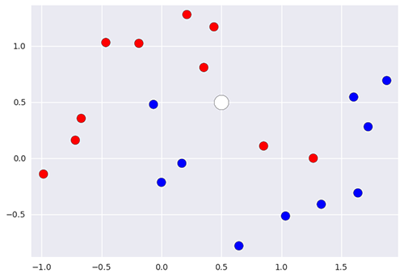
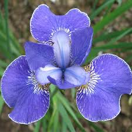
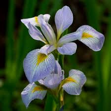
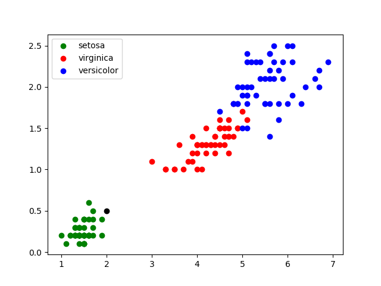
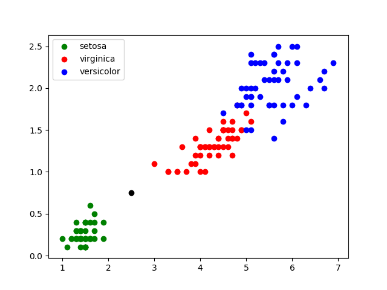
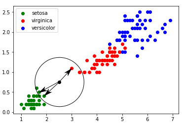

<link rel="stylesheet" href="../../assets/style.css" />
<script src="https://cdn.jsdelivr.net/npm/mathjax@3/es5/tex-mml-chtml.js"></script>

# Présentation du problème

Pouvez-vous dire quelle est la couleur du point blanc ?

<div style="display: flex; flex-direction:column;  text-align: center; ">
  
</div>
<br>

## Les algorithmes des k plus proches voisins (k nearest neighbors)

Une façon de résoudre le problème posé consiste à :

- choisir un nombre entier k,
- faire la liste des k plus proches voisins du point inconnu,
- compter le nombre de rouge et de bleu parmi ces voisins,
- attribuer la couleur en fonction du plus grand résultat trouvé.

## Activité : Classification des iris

Il est assez compliqué de déterminer l’espèce d’un iris lorsqu’on est face à un spécimen dans la nature. Nous considérerons trois espèces d’iris :

- Iris Setosa
- Iris Virginica
- Iris Versicolor

<div style="display: flex;  border: 1px solid #ccc; text-align: center; border-radius: 8px;">
  
  
  
</div>
<br>

Elles correspondent, dans l'ordre, à iris setosa, iris virginica et iris versicolor.

Edgar Anderson (un botaniste Américain) a collecté les caractéristiques (largeur des sépales, longueur des sépales, largeur des pétales, la longueur des pétales) de 150 de fleurs et leur a attribué leur bonne espèce. Pour simplifier notre travail nous n’utiliserons que la longueur et la largeur des pétales. Les données sont disponibles en <a href="./iris.csv">cliquant ici</a>. Ce tableau contient les deux caractéristiques et bien sûr l’espèce de chaque fleur :

- 0 pour « iris setosa » ;
- 1 pour « iris virginica » ;
- 2 pour « iris versicolor ».

### Graphique

Pour se faire une idée de la classification des iris, il est intéressant de dessiner ces données sur un graphique. Nous utiliserons une couleur par espèce. Voici le code Python que nous pouvons utiliser :

```python
import pandas
import matplotlib.pyplot as plt

iris=pandas.read_csv("iris.csv")
x=iris.loc[:,"petal_length"]
y=iris.loc[:,"petal_width"]
lab=iris.loc[:,"species"]

plt.scatter(x[lab == 0], y[lab == 0], color='g', label='setosa')
plt.scatter(x[lab == 1], y[lab == 1], color='r', label='virginica')
plt.scatter(x[lab == 2], y[lab == 2], color='b', label='versicolor')

plt.legend()
plt.show()
```

Ce code utilise les bibliothèques Pandas pour extraire les données et Matplotlib pour tracer la graphe. Après avoir placé le fichier iris.csv dans votre répertoire, recopiez ce code et exécutez-le. Vous devriez obtenir quelque-chose comme ceci :

<div style="display: flex; flex-direction:column;  border: 1px solid #ccc; text-align: center; border-radius: 8px;">
  
  <span style="font-style: italic; color: gray;">Graphe représentant la largeur des Iris en fonction de la longueur pour plusieur fleurs appartenant aux trois catégories</span>
</div>

<br>

### Classification

Maintenant, imaginons que vous mesuriez les caractéristiques d’une nouvelle plante faisant 0,5 cm de large et 2 cm de long. Plaçons-la sur le graphe en rajoutant le code `plt.scatter(2.0, 0.5, color='k')` :

<div style="display: flex; flex-direction:column;  border: 1px solid #ccc; text-align: center; border-radius: 8px;">
  
  <span style="font-style: italic; color: gray;">Graphe représentant la largeur des Iris en fonction de la longueur avec une nouvelle fleur</span>
</div>

<br>


Il est alors relativement facile de trouver l’espèce de cette plante : **Iris Setosa**.

Il peut y avoir des cas plus difficiles : largeur du pétale = 0,75 cm ; longueur du pétale = 2,5 cm :

<div style="display: flex; flex-direction:column;  border: 1px solid #ccc; text-align: center; border-radius: 8px;">
  
  <span style="font-style: italic; color: gray;">Graphe représentant la largeur des Iris en fonction de la longueur avec encore une nouvelle fleur</span>
</div>

<br>


C’est ici que nous avons besoin de l’algorithme des k plus proches voisins :

- on calcule la distance entre notre point (largeur du pétale = 0,75 cm ; longueur du pétale = 2,5 cm) et chaque point issu du jeu de données « iris » (à chaque fois c'est un calcul de distance entre 2 points tout ce qu'il y a de plus classique) ;
- on sélectionne uniquement les k distances les plus petites (les k plus proches voisins) ;
- parmi les k plus proches voisins, on détermine quelle est l'espèce majoritaire. On associe à notre « iris mystère » cette « espèce majoritaire parmi les k plus proches voisins ».

Ainsi dans cet exemple, pour k = 3 :

<div style="display: flex; flex-direction:column;  border: 1px solid #ccc; text-align: center; border-radius: 8px;">
  
  <span style="font-style: italic; color: gray;">Application de l'algorithme des trois plus proches voisisns</span>
</div>

<br>

Deux plus proches voisins appartienent à l’espèce « setosa » et un seul appartient à l’espèce « virginica ». La plante sera donc catégorisée dans l’espèce « setosa ».

### Algorithme

Nous allons tenter d'implémenter directement cet algorithme en Python. Pour cela, voici un code pour commencer qui permet d'extraire les données du fichier csv et de les transformer en un tableau de tuples :

```python
import pandas
import matplotlib.pyplot as plt

iris=pandas.read_csv("iris.csv")
x=iris.loc[:,"petal_length"]
y=iris.loc[:,"petal_width"]
lab=iris.loc[:,"species"]

longueur = x.to_list()
largeur = y.to_list()
espece = lab.to_list()

# tab contient tous des tuples de
# la forme (longueur, largeur, espece)
tab = []

for i in range(len(longueur)):
    tab.append((longueur[i], largeur[i], espece[i]))
```

1) Commencez par créer une fonction distance(fleur1, fleur2) qui renvoie la distance entre deux fleurs chacune définie par un tableau contenant la longueur et la largeur de ses pétales.

<details>
  <summary style="cursor: pointer; font-weight: bold;"><u>Solution</u></summary>
  <div style="margin-top: 10px;">
    <pre><code>
    def distance(fleur1, fleur2):
      return (fleur1[0] - fleur2[0])**2 + (fleur1[1] - fleur2[1])**2
    </code></pre>
  </div>
</details>


2) Implémentez l'algorithme des k plus proches voisins en python et testez-le sur les exemples précédents. Changez éventuellement la valeur de k. La fonction pourra s'appeler `kppv(fleurs, fleur, k)`. On pourra créer une **liste de tuples** `(distance, espece)`, la trier avec `sorted` et trouver l'espèce majoritaire parmi les k premières.