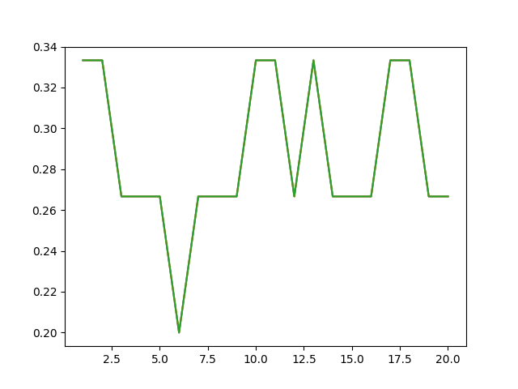
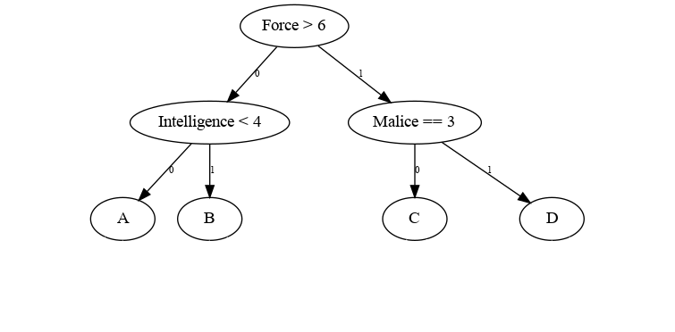
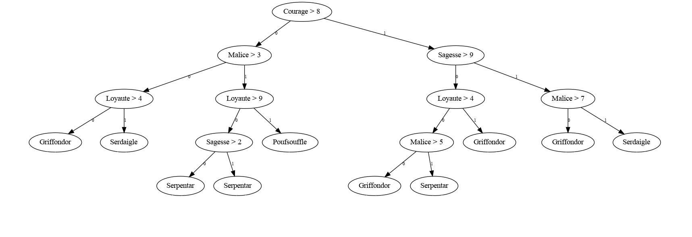

<link rel="stylesheet" href="../../assets/style.css" />
<script src="https://cdn.jsdelivr.net/npm/mathjax@3/es5/tex-mml-chtml.js"></script>

# TP : Choixpeau Magique

## Matériel fourni

-   le fichier <a href="choixpeauMagique.csv"> choixpeauMagique.csv </a>
-   le fichier <a href="classification_common.py"> classification_common.py</a>
-   le fichier <a href="distances.py"> distances.py</a>
-   le fichier <a href="hp_knn_squel.py"> hp_knn_squel.py</a>


## Les données

On dispose d'un fichier contenant les attributs `Courage, Loyauté, Sagesse et Malice` d'un certain nombre d'étudiants de Poudlard.

Pour ces étudiants, on fournit également la maison à laquelle ils ont été affecté par le choixpeau. Les quatre maisons sont **Gryffondor**, **Serpentard**, **Poufsouffle** et **Serdaigle**.

On veut se servir de cette base d'exemple pour classifier d'autres étudiants et prédire leur classe.

```python
import sys
sys.path.append('src')
from classification_common import *
examples = read_example_file('datas/choixpeauMagique.csv')
print(get_attributs(examples))

```

    {'Loyaute', 'Nom', 'Malice', 'Maison', 'Courage', 'Sagesse'}


# En utilisant l'algorithme des $`k`$ plus proches voisins


## l'algorithme $k$-nn

Renommer le fichier `hp_knn_squel.py` en `hp_knn.py`, puis compléter les fonctions pour implanter un algorithme knn.


## Utilisation sur l'exemple

```python
from hp_knn import knn, normalise_eleve
from classification_common import read_example_file

examples = read_example_file('datas/choixpeauMagique.csv')

hermione = {'Nom': 'Hermione', 'Courage': 8, 'Loyaute': 6, 'Sagesse': 6, 'Malice': 6}
drago = {'Nom' : 'Drago', 'Courage': 6, 'Loyaute': 6, 'Sagesse': 5, 'Malice': 8}
cedric = { 'Nom': 'Cédric', 'Courage': 7, 'Loyaute': 10, 'Sagesse': 5, 'Malice': 6 }

print(knn(examples, 5, drago))
```

    Serpentard


## Calcul du taux d'erreur

Compléter la fonction `accuracy` pour qu'elle renvoie la proportion d'élèves mal classés.


### simple

Le taux d'erreur est calculé de la façon suivante :

-   On choisit la fréquence $`f`$ des exemples qui seront utilisés dans le calcul du taux d'erreur ;
-   On sépare les exemples en deux ensembles $`E`$ et $`T`$ de fréquence $`1-f`$ et $`f`$.
-   On utilise l'ensemble $`E`$ pour classifier et l'ensemble $`T`$ pour tester : on obtient un taux d'erreur.

```python
import matplotlib.pyplot as plt

from hp_knn import knn, accuracy
from classification_common import read_example_file

examples = read_example_file('datas/choixpeauMagique.csv')

f = .3
n = len(examples)
t = int(n * f)

X = list(range(1, 21))
Y = [accuracy(examples[t:], examples[:t], k) for k in X]
plt.plot(X, Y)
FIG = './figs/knn-acc.png'
plt.savefig(FIG)
FIG
```




### par validation croisée

On choisit un entier $`t`$ compris entre 2 et $`n`$, où $`n`$ est la taille de notre ensemble d'exemples.

On divise l'ensemble d'exemples en $`t`$ sous-ensembles $`T_i`$; $`0\leqslant i < t`$.

Pour tout $`i\in [0,\ldots t-1]`$, on mesure le taux d'erreurs sur $`T_i`$ en utilisant $`E-T_i`$ pour classifier. On obtient ainsi $`t`$ taux d'erreurs.

On en déduit un intervalle de confiance à 95\\% pour le taux d'erreur :

$$`\left[f-\frac{1}{\sqrt{t}}; f+\frac{1}{\sqrt{t}}\right]`$$

où $`f`$ est la fréquence moyenne des taux d'erreur.

Réaliser une fonction `accuracy_range` qui renvoie un couple $`(a,b)`$ fournissant les bornes de l'intervalle de confiance :

```python
import matplotlib.pyplot as plt

try:
    from hp_knn import knn, accuracy_range
    from classification_common import read_example_file
except:
    import sys
    sys.path.append('src')
    from hp_knn import knn, accuracy_range
    from classification_common import read_example_file

examples = read_example_file('datas/choixpeauMagique.csv')

print(accuracy_range(examples,6, 30))
```

    (0.250759147498278, 0.6159075191683887)


# En utilisant un arbre de décision


## représentation des arbres

On utilise l'algorithme ID3 C4.5 pour construire un arbre de décision.

Le module `criterion` permet de représenter des tests d'égalité et d'inégalité.

Le module `tree` inclus une hiérarchie de noeux (`Node`) permettant de représenter différents type de noeud et de les afficher.

```python
import sys
sys.path.append('src')
from tree import Tree, TreeError, Node, BooleanTreeNode, TestNode, leaf, decision
from criterion import LessThanCriterion, EqualCriterion, GreaterThanCriterion

VIDE = Tree()
force_sup_6 = GreaterThanCriterion('Force', 6)
malice_eq_3 = EqualCriterion('Malice', 3)
int_inf_4 = LessThanCriterion('Intelligence', 4)

a = Tree(TestNode(force_sup_6),
         Tree(TestNode(int_inf_4),
              leaf(Node('A')), leaf(Node('B'))),
         Tree(TestNode(malice_eq_3),
              leaf(Node('C')), leaf(Node('D'))))
repr(a)
```



Les arbres de décisions peuvent rendre une décision :

```python
print(decision(a, { 'Force': 7, 'Malice': 3}))
```

    D


## notion d'entropie

On mesure le degré de mélange d'un ensemble d'exemple par l'entropie des valeurs de la classe choisie. C'est-à-dire :

$$`E = \sum_{v\in \mathcal{V}}f_v\log_2(f_v)`$$

où $`\mathcal{V}`$ est l'ensemble des différentes valeurs de la classe, et $`f_v`$ la fréquence de cette valeur dans les examples.

Le module `entropy` fournit une fonction `entropy` permettant d'effectuer le calcul. Elle prend en paramètre une liste d'exemples et le nom de l'attribut classe.

On fournit également une fonction `gain`. Cette dernière permet de calculer la différence entre l'entropie d'un ensemble d'exemples et l'entropie moyenne d'un ensemble de groupement d'exemples.

L'algorithme vise à minimiser l'entropie en choisissant les attributs qui classent le mieux les exemples, c'est-à-dire pour lesquels le gain est maximum.


## regrouper les exemples

Les exemples vont être regroupés selon plusieurs critères :

-   par valeurs : on forme des groupes d'exemples qui ont la même valeur pour un certain attribut ;
-   par inégalité : on sélectionne les exemples dont la valeur est (strictement) inférieure à une valeur donnée.

La fonction `regroupe` du module `classification_common` prend en paramètres une liste d'exemples `exemples`, un attribut `att` et renvoie un dictionnaire des associations `<k: v>` où :

-   `k` est égal à `ex[att]` pour au moins un attribut ;
-   `v` est une liste regroupant tous les exemples `ex` vérifiant `ex[att] = k`.

La donnée de ce dictionnaire `groupes` permet :

-   d'obtenir les valeurs de l'attribut : `groupes.values()`
-   de séparer en deux groupes d'exemples : `sum(groupes[k] for k in groupes if k > val)` et `sum(groupes[k] for k in groupes if k <= val)`


## le choix glouton

Pour chaque attribut, on mesure le gain obtenu en terme d'entropie, on en déduit l'attribut le plus classant au moment donné : C'est celui pour lequel le gain est maximum.

Toutefois, les attributs n'étant pas binaires, nous devons déterminer également la valeur la plus classante pour l'attribut choisi.

On mesure le gain obtenu en séparant la série en deux pour chaque valeur d'attribut. La valeur maximisant le gain est choisie comme coupure.


## l'algorithme

Fonction $`\texttt{creer\_arbre}(S, \ell)`$

1.  **Si** tous les exemples de $`S`$ sont de la même classe ou $`\ell`$ est vide, **alors**
    1.  déterminer la classe la plus fréquente $`c`$
    2.  renvoyer une $`\texttt{feuille}(c)`$
2.  **Sinon** :
    1.  Trouver le meilleur couple (attribut, coupure) $`(a, c)`$ avec $`a\in\ell`$
    2.  Répartir les exemples de $`S`$ en 2 sous-ensembles $`S_i`$, selon leur valeur pour cet attribut.
    
    3.  $`g \leftarrow \texttt{creer\_arbre}(S_0, l-\lbrace a\rbrace)`$
    
    4.  $`d \leftarrow \texttt{creer\_arbre}(S_1, l-\lbrace a\rbrace)`$
    5.  **renvoyer** $`\texttt{Arbre}( a > c, g, d)`$

**à faire** Implanter l'algorithme pour obtenir un arbre de décision pour le choixpeau.

```python
import sys
sys.path.append('src')
from id3 import id3_c45_tree
from classification_common import read_example_file

examples = read_example_file('datas/choixpeauMagique.csv')

repr(id3_c45_tree(examples, ['Sagesse', 'Loyaute', 'Courage', 'Malice' ], 'Maison'))
```



**à faire** mesurer le taux d'erreur de l'arbre de décision.
