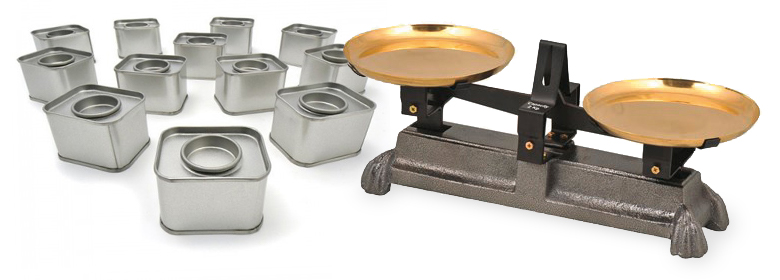

<link rel="stylesheet" href="../../assets/style.css" />

# Tri de boites 

## Un peu d’histoire
On vous demande de ranger la réserve dans la petite épicerie où vous 
travaillez durant les vacances avant l’ouverture des portes.  

Malheureusement, ces dernières ont perdu leurs étiquettes, et vous ne savez 
pas où les ranger.  

Votre manager vous indique que l’on peut les repérer car elles ont toutes des 
poids différents les unes par rapport aux autres, **une par une**.  
 
*Exemple : vous prenez deux boîtes, une est forcément plus lourde que l’autre.*

  

 

**A faire** : Proposer une méthode pour ranger les boites de la plus légère à la plus lourde. *( voir feuille distribué )*

1. Dans un petit texte (en français), rédiger votre proposition pour la rendre compréhensible par une personne qui ne connait pas l'informatique.

2. Ecrire un pseudo code de votre proposition.