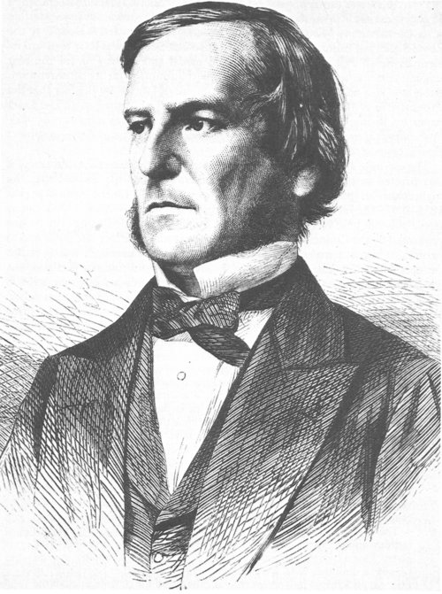

# Les Conditions

## Un peu d'histoire

<div style="display: flex; flex-direction:column;  border: 1px solid #ccc; text-align: center; border-radius: 8px;">
  
  <span style="font-style: italic; color: gray;">George BOOLE (1815-1864)</span>
</div>
  
<br>

Mathématicien anglais, il publie en 1854 les **"Lois de la pensée"**. Dans ce livre, il décrit comment toute la logique peut être définie par un principe simple : **le binaire**.

## Les opérateurs booléens

Un booléen en Python est un type de données qui ne peut prendre que deux valeurs possibles : `True` (vrai) ou `False` (faux).

### Applications

> #### Application I
>
> 💻 __Sur l'ordinateur :__ Tester les trois opérateurs avec des valeurs différentes et compléter leurs tables de vérité.
>
> Exemple de code pour tester les opérateurs :
>
```python
r = not False
```
>
<div style="display: flex; flex-direction: row; justify-content: space-evenly">
    <table>
        <tr>
            <th>A</th><th>not A</th>
        </tr>
        <tr>
            <td>False</td><td></td>
        </tr>
        <tr>
            <td>True</td><td></td>
        </tr>
    </table>
    <table>
        <tr>
            <th>A</th><th>B</th><th>A or B</th>
        </tr>
        <tr>
            <td>False</td><td>False</td><td></td>
        </tr>
        <tr>
            <td>False</td><td>True</td><td></td>
        </tr>
        <tr>
            <td>True</td><td>False</td><td></td>
        </tr>
        <tr>
            <td>True</td><td>True</td><td></td>
        </tr>
    </table>
    <table>
        <tr>
            <th>A</th><th>B</th><th>A and B</th>
        </tr>
        <tr>
            <td>False</td><td>False</td><td></td>
        </tr>
        <tr>
            <td>False</td><td>True</td><td></td>
        </tr>
        <tr>
            <td>True</td><td>False</td><td></td>
        </tr>
        <tr>
            <td>True</td><td>True</td><td></td>
        </tr>
    </table>
</div>

>
>
> #### Application II
>
> 🖋️__Sur feuille__, puis vérifier sur l'ordinateur
>
> Donner la valeur (`True` ou `False`) des expressions suivantes :

```python
15 <= 20 or 1> 150
2 < 4 and 2 < 3
"A" == "A" and "B"=="B"
not (1 < 3)
not (15 <= 20) or 1 < 150
3 < 5 and ((7 < 5) or (2 < 3))
```

## Structures conditionnelles
Dans les codes ci-dessous, les conditions correspondent à une instruction qui renvoie un booléen.

### Structure du "if" seul

```python
# Instructions qui précèdent

if condition :
    # Bloc d'instructions exécuté si la condition renvoie True

# Instructions qui suivent
```

### Structure du "if else"

```python
# Instructions qui précèdent

if condition :
    # Bloc d'instructions exécuté si la condition renvoie True
else :
    # Bloc d'instructions exécuté si la condition renvoie False

# Instructions qui suivent
```

### Structure du "if elif else"

```python
# Instructions qui précèdent

if condition n°1 :
    # Bloc d'instructions exécuté si la condition n°1 renvoie True
elif condition n°2 :
    # Bloc d'instructions exécuté si la condition n°2 True (mais pas la n°1)
else :
    # Bloc d'instructions exécuté si les conditions n°1 et n°2 renvoient False

# Instructions qui suivent
```

### Applications

> #### Application III : Analyse de code
>
> On considère le code suivant :
>

```python
if x < 1:
    print('valeur plus petite que 1')
if 1 <= x and x <= 3:
    print('valeur comprise entre 1 et 3')
else:
    print('valeur plus grande que 3')
```
>
> 1) Expliquer pourquoi le programme ne va pas donner des résultats cohérents.
>
> 2) Proposer une version corrigée de ce code.
>
> #### Application IV : Années bissextiles
>
> Une année bissextile est une année comportant 366 jours au lieu de 365 jours pour les années régulières. Le jour supplémentaire, le 29 février, est placé après le dernier jour de ce mois qui compte habituellement 28 jours.
> 
> Une année est bissextile :
>
> - si elle est multiple de 4 mais pas multiple de 100,
> - ou si elle est multiple de 400.

> A faire : Écrire un code qui :
> - prend un entier correspondant à une année dans la variable `annee`,
> - test si l'année est bissextile,
> - affiche `True` si l'année est bissextile ou `False` sinon.
>
> Amélioration de code : Vous pouvez demander l'année à l'utilisateur en utilisant la fonction `input()`